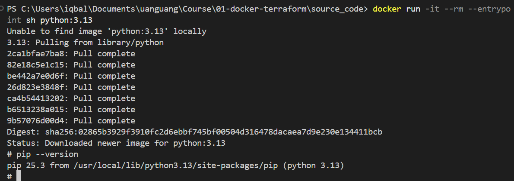
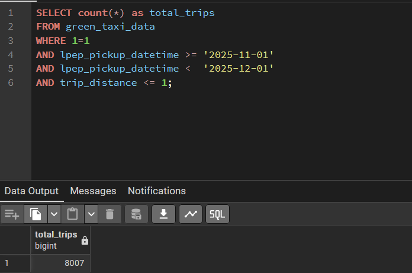
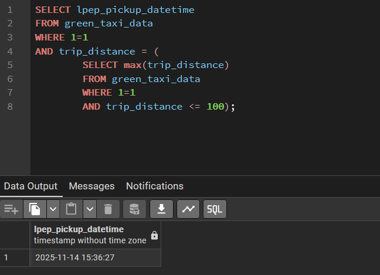
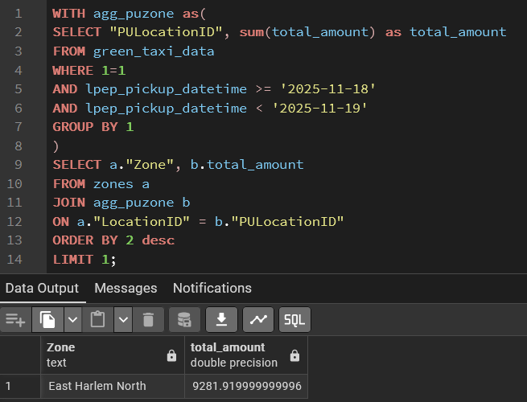
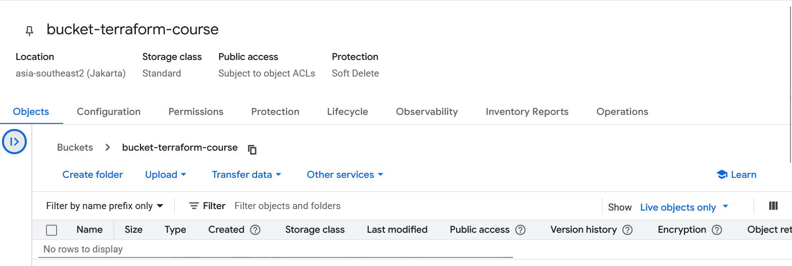

# Homework 01
## 1. Understanding Docker Images.

Run docker with the python:3.13
```bash
docker run -it --rm --entrypoint sh python:3.13
```
Result:


## 2. Understanding Docker networking and docker-compose.
```yaml
services:
  db:
    container_name: postgres
    image: postgres:17-alpine
    environment:
      POSTGRES_USER: 'postgres'
      POSTGRES_PASSWORD: 'postgres'
      POSTGRES_DB: 'ny_taxi'
    ports:
      - '5433:5432'
    volumes:
      - vol-pgdata:/var/lib/postgresql/data

  pgadmin:
    container_name: pgadmin
    image: dpage/pgadmin4:latest
    environment:
      PGADMIN_DEFAULT_EMAIL: "pgadmin@pgadmin.com"
      PGADMIN_DEFAULT_PASSWORD: "pgadmin"
    ports:
      - "8080:80"
    volumes:
      - vol-pgadmin_data:/var/lib/pgadmin

volumes:
  vol-pgdata:
    name: vol-pgdata
  vol-pgadmin_data:
    name: vol-pgadmin_data
```
The hostname and port pgadmin should be either db:5432 or localhost:5433 (if it connect from localhost)

## Ingestion Green Taxi Data
[Script Ingestion Green Taxi Data](source_code/ingest_green_taxi_data/ingest_green_taxi_data.py)
[Dockerfile Ingestion Green Taxi Data](source_code/ingest_green_taxi_data/Dockerfile)
Execute the script via docker.
```bash
docker build -f ingest_green_taxi_data/Dockerfile -t green_taxi:v001 .

docker run -it --network=source_code_default --env-file=.env green_taxi:v001 --target-table=green_taxi_data    
```

## Ingestion Zones Data
[Script Ingestion Zones Data](source_code/ingest_zones_data/ingest_zones_data.py)
[Dockerfile Ingestion Zones Data](source_code/ingest_zones_data/Dockerfile)
Execute the script via docker.
```bash
docker build -f ingest_zones_data/Dockerfile -t zones:v001 .

docker run -it --network=source_code_default --env-file=.env zones:v001 --target-table=zones --chunksize=100000   
```

After the scripts have executed, check the data in the green_taxi_data and zones tables.
Note: network names, image names, and table names may differ from what I built.

## 3. Counting short trips
[SQL Script](source_code/sql/count_short_trips.sql)

Result:


## 4. Longest trip for each day
[SQL Script](source_code/sql/longest_trip_for_each_day.sql)

Result:


## 5. Biggest pickup zone
[SQL Script](source_code/sql/biggest_pickup_zone.sql)

Result:


## 6. Largest tip
[SQL Script](source_code/sql/largest_tip.sql)

Result:


## 7. Terraform Workflow
Which of the following sequences, respectively, describes the workflow for:
1. Downloading the provider plugins and setting up backend,
2. Generating proposed changes and auto-executing the plan
3. Remove all resources managed by terraform`

The answer -> terraform init, terraform apply -auto-approve, terraform destroy

[Terraform Script](terraform/main.tf)
[Terraform Variable Script](terraform/variables.tf)

Result:



