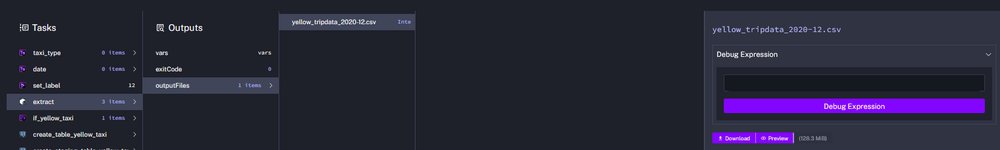
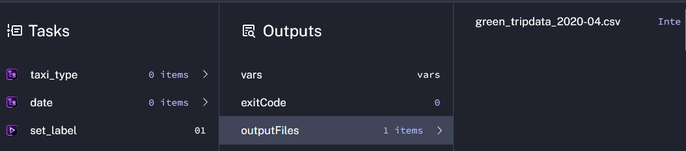
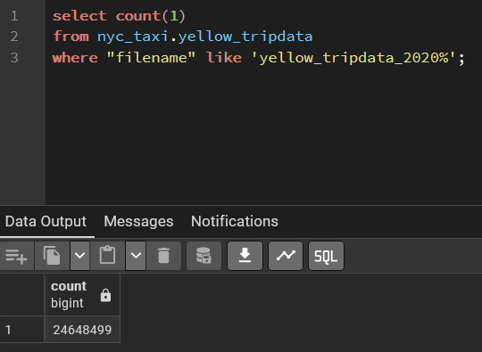
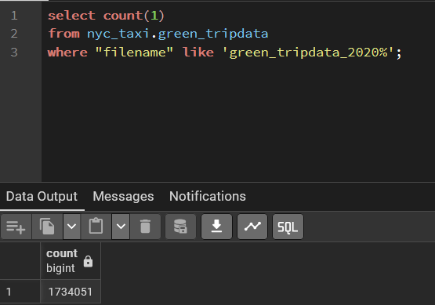
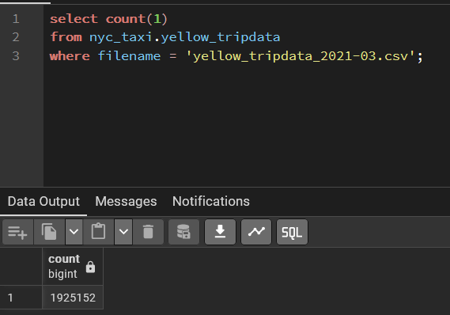
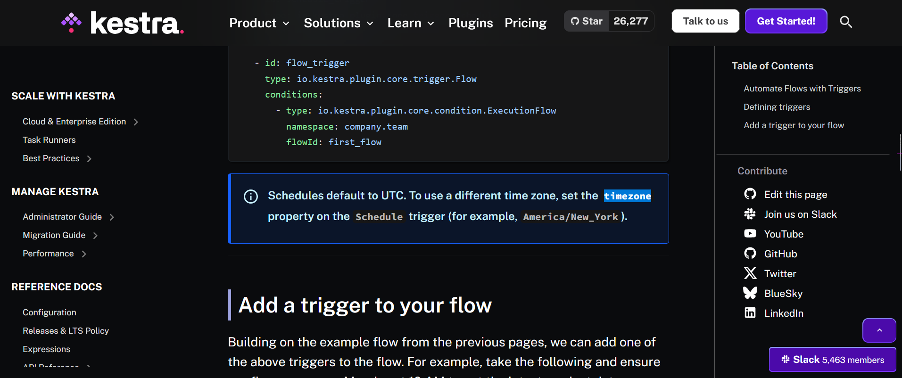

# Homework 02
## Assignment

Ingest data yellow and green taxi trip data.

This flow will be execute the data 01-2021 until 07-2021 for each yellow and green taxi. This flow using loop (foreach) combination of Year-month and taxi type. You can execute the flow manually because it hasn't schedule trigger.

[Yaml file flows](source_code/kestra/course_de.ingest_nyc_taxi_trip_data.yaml)

Result:

## Quiz Questions
### 1. size of output file yellow_tripdata_2020-12.csv of the extract task

Answer: 128.3 MiB

Result:

### 2. rendered filename if input taxi is set to green, year is set to 2020 and month is set to 04

Answer: green_tripdata_2020-04.csv

Result:

### 3. count row for yellow taxi data for all CSV fie within year 2020

Answer: 24,648,499

[SQL Script](source_code/sql/count_row_yellow_taxi_2020.sql)

Result:

### 4. count row for green taxi data for all CSV fie within year 2020

Answer: 1,734,051

[SQL Script](source_code/sql/count_row_green_taxi_2020.sql)

Result:

### 4. count row for green taxi data for all CSV fie within year 2020

Answer: 1,734,051

[SQL Script](source_code/sql/count_row_green_taxi_2020.sql)

Result:

### 5. count row for yellow taxi data for March 2021 CSV file

Answer: 1,925,152

[SQL Script](source_code/sql/count_row_yellow_taxi_2021-03.sql)

Result:

### 6. set timezone to New York in a schedule trigger

Answer: Add a timezone property set to America/New_York in the Schedule trigger configuration

Based on documentation of kestra:

