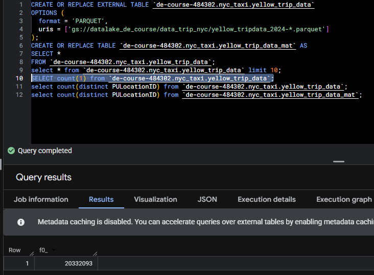
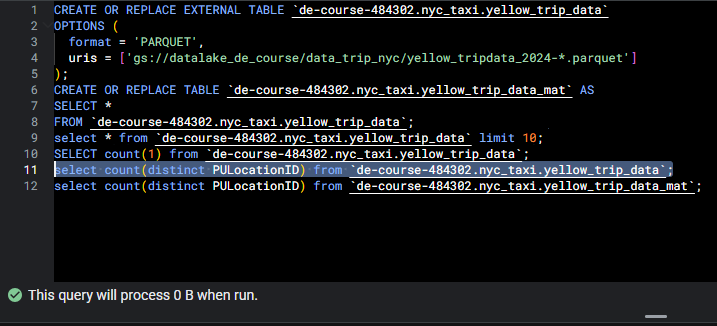
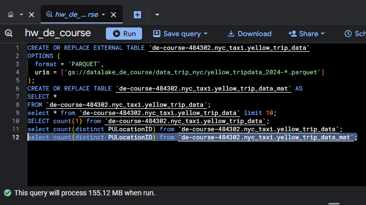
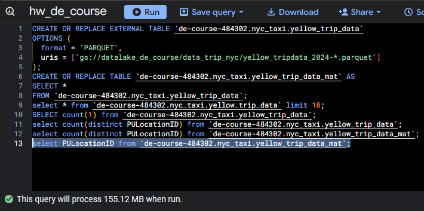
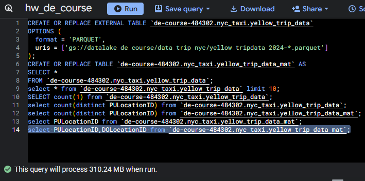
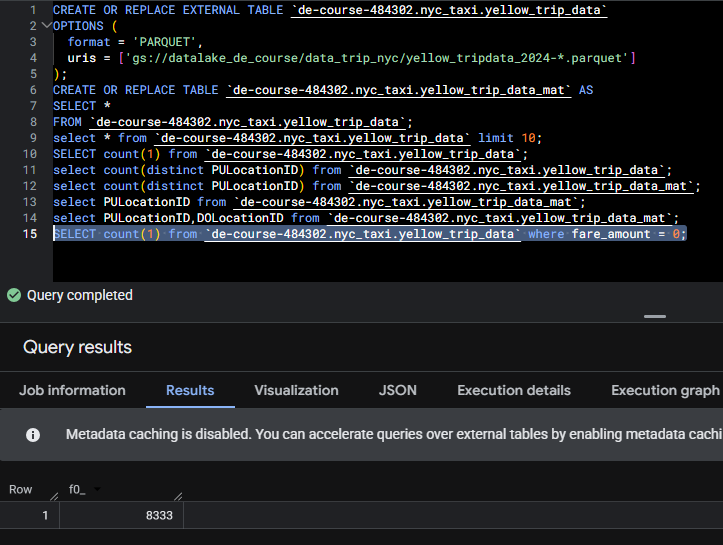
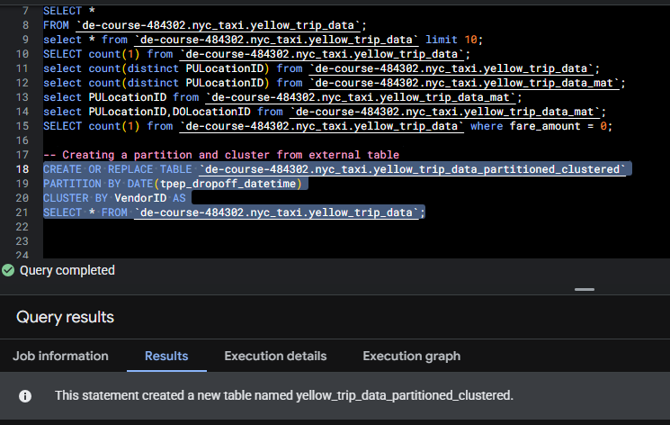
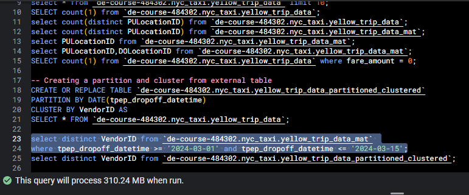
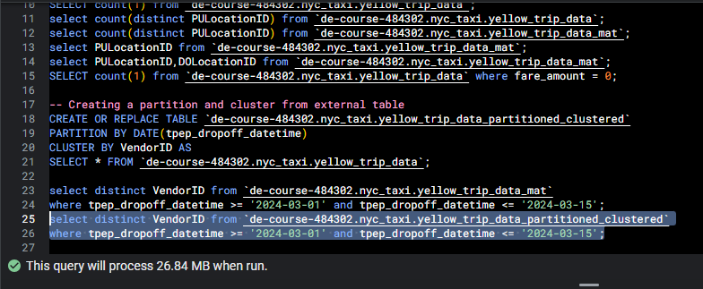
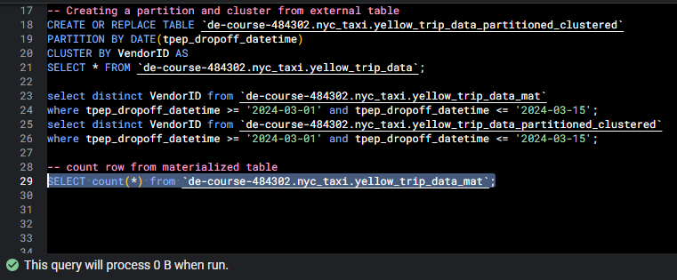

# Homework 03
In this session, I use Airflow for the ochestration. The Airflow will be donwload data from web then upload to GCS. First step is run the docker compose for deploy Airflow in localhost.
``` bash
cd /03-data-warehouse/compose

docker compose up -d
```

After Airflow and DB are deployed, copy your credential google cloud (api key .json) to folder data. Open Airflow then go to menu Admin, choose Variables. Click menu + besides Actions. Add key api_key_gc and add value /opt/airflow/data/{your json file}.json. Add more variable for key bucket_name and folder_gcs. After that, make sure web_to_gcs is in DAGs menu and run that DAG. If it success, the data will show in your bucket.

Create external table in bigquery. Run this query.

``` sql
CREATE OR REPLACE EXTERNAL TABLE `{project_id}.{your_schema}.{your_table_name}`
OPTIONS (
  format = 'PARQUET',
  uris = ['gs://{your_bucket}/{your_folder}/yellow_tripdata_2024-*.parquet']
);
```

Create materialize table in bigquery

``` sql
CREATE OR REPLACE TABLE `{project_id}.{your_schema}.{your_table_name}_mat` AS
SELECT *
FROM `{project_id}.{your_schema}.{your_table_name}`;
```

## 1. Counting short trips
Count of records for the 2024 Yellow Taxi Data

``` sql
SELECT count(1) from `de-course-484302.nyc_taxi.yellow_trip_data`;
```

Result:



## 2. Different estimeted amount of data from external and materialized table
Count distinct PULocationID from both table

``` sql
select count(distinct PULocationID) from `de-course-484302.nyc_taxi.yellow_trip_data`;
```

Result:



``` sql
select count(distinct PULocationID) from `de-course-484302.nyc_taxi.yellow_trip_data_mat`;
```

Result:



## 3. Columnar Storage
select PULocationID from materialized table and select PULocationID and DOLocationID from materialized table

``` sql
select PULocationID from `de-course-484302.nyc_taxi.yellow_trip_data_mat`;
```

Result:



``` sql
select PULocationID, DOLocationID from `de-course-484302.nyc_taxi.yellow_trip_data_mat`;
```

Result:



## 4. Counting zero fare trips
Counting record where the fare_amount is 0

``` sql
SELECT count(1) from `de-course-484302.nyc_taxi.yellow_trip_data` where fare_amount = 0;
```

Result:




## 5. Partitioning and Clustering
Create table from external table then partition and cluster 

``` sql
CREATE OR REPLACE TABLE `de-course-484302.nyc_taxi.yellow_trip_data_partitioned_clustered`
PARTITION BY DATE(tpep_dropoff_datetime)
CLUSTER BY VendorID AS
SELECT * FROM `de-course-484302.nyc_taxi.yellow_trip_data`;
```

Result:



## 6. Partition data
select distinct VendorID from materialized table and partitioned table. Use filter tpep_dropoff_datetime 2024-03-01 and 2024-03-15 (inclusive). How about the estimated of data.

``` sql
select distinct VendorID from `de-course-484302.nyc_taxi.yellow_trip_data_mat` 
where tpep_dropoff_datetime >= '2024-03-01' and tpep_dropoff_datetime <= '2024-03-15';
```

Result:



``` sql
select distinct VendorID from `de-course-484302.nyc_taxi.yellow_trip_data_partitioned_clustered`
where tpep_dropoff_datetime >= '2024-03-01' and tpep_dropoff_datetime <= '2024-03-15';
```

Result:



## 7. External Table
Data stored in GCP bucket for external table that I created. Bigquery only stores the metadata.

## 8. Clustering best practice
Clustering the data is not always best practice. Clustering will help mostly for large tables. If it in small table, clustering not effective. Cluster only when your queries often filter or aggregate by specific columns.

## 9. Understanding table scans
select count(*) from materialized table. how many the estimated of data from that query? The estimated of data is 0. This happen because bigquery is a columnar data warehouse. it will not 0 if I attach the column in query.

``` sql
SELECT count(*) from `de-course-484302.nyc_taxi.yellow_trip_data_mat`;
```

Result:


