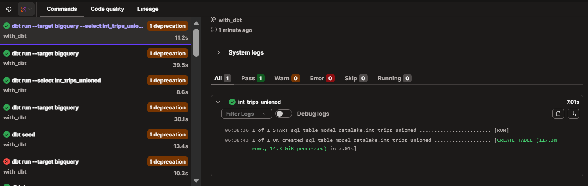
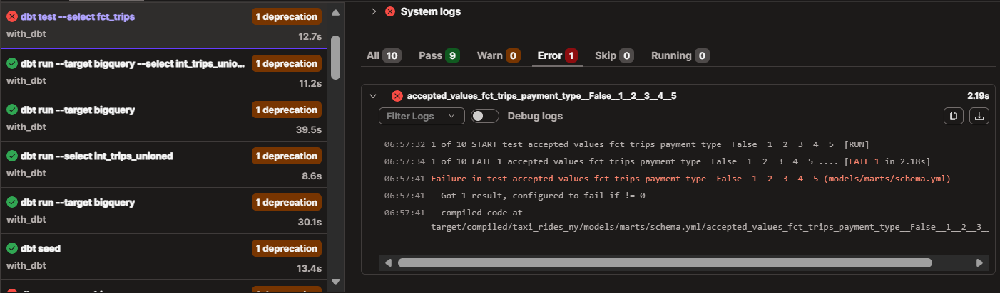
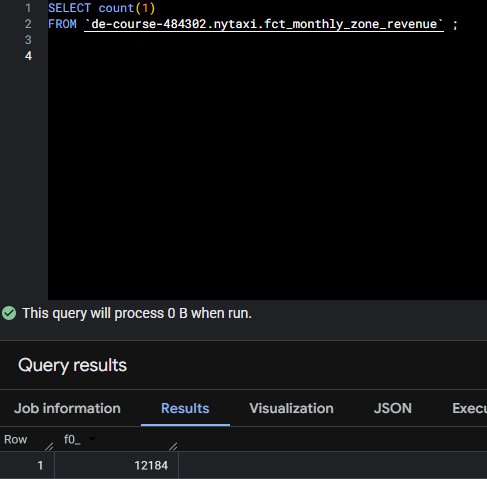
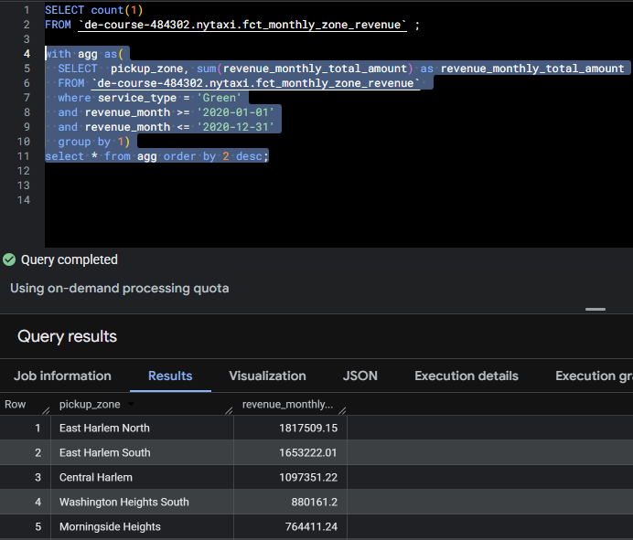
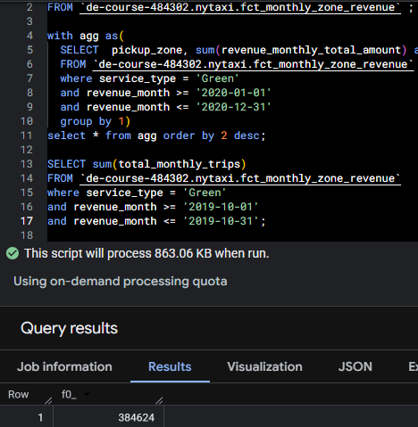
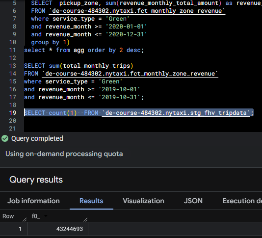

# Homework 04
In this session, I use Airflow for the ochestration. The Airflow will be donwload data from web then upload to GCS. First step is run the docker compose for deploy Airflow in localhost.
``` bash
cd /03-data-warehouse/compose

docker compose up -d
```

For load Green and Yellow taxi data 2019-2020, you must run dag id ingest_data_nyc_taxi at airflow UI. Make sure to create variable data_last_month (looping month you choose e.g. 12, it means 12 month looping), data_service (green or yellow), and data_year (year you want to load).

Run this command in dbt, this command will install packages, create table based on file in folder seeds and create table based on file in folder models
```bash
dbt deps

dbt seed

dbt run --target prod
```

## 1. dbt Lineage and Execution
Run this command in dbt.

```bash
dbt run --select int_trips_unioned
```

this will run model int_trips_unioned only.

result:


## 2. dbt Tests
Search name model name fct_trips at schema.yml folder marts. Change this script at name payment_type.

```yml
columns:
  - name: payment_type
    data_tests:
      - accepted_values:
          arguments:
            values: [1, 2, 3, 4, 5]
            quote: false
```

The dbt will fail the test because it show the error.

result:


## 3. Counting Records in fct_monthly_zone_revenue
The records will show 12,184

```sql
SELECT count(1)
FROM `de-course-484302.nytaxi.fct_monthly_zone_revenue` ;
```

result:


## 4. Best Performing Zone for Green Taxis (2020)
The best performing zone for Green Taxi in 2020 will be East Harlem North.

```sql
with agg as(
  SELECT  pickup_zone, sum(revenue_monthly_total_amount) as revenue_monthly_total_amount
  FROM `de-course-484302.nytaxi.fct_monthly_zone_revenue` 
  where service_type = 'Green'
  and revenue_month >= '2020-01-01'
  and revenue_month <= '2020-12-31'
  group by 1)
select * from agg order by 2 desc;
```

result:


## 5. Green Taxi Trip Counts (October 2019)
Total number trips for green taxi in 2019 384,624

```sql
SELECT sum(total_monthly_trips)
FROM `de-course-484302.nytaxi.fct_monthly_zone_revenue` 
where service_type = 'Green'
and revenue_month >= '2019-10-01'
and revenue_month <= '2019-10-31';
```

result:


## 6. Build a Staging Model for FHV Data
Run dags id ingest_data_fhv_tripdata at airflow UI. This will load data fhv 2019 to warehouse. After that run this command to create table staging for renamed column of data raw.

```bash
dbt run --target prod --select stg_fhv_tripdata
```

Count record of table staging renamed column of data raw. The count will show 43,244,693 row.

```sql
SELECT count(1)  FROM `de-course-484302.nytaxi.stg_fhv_tripdata`;
```

result:
