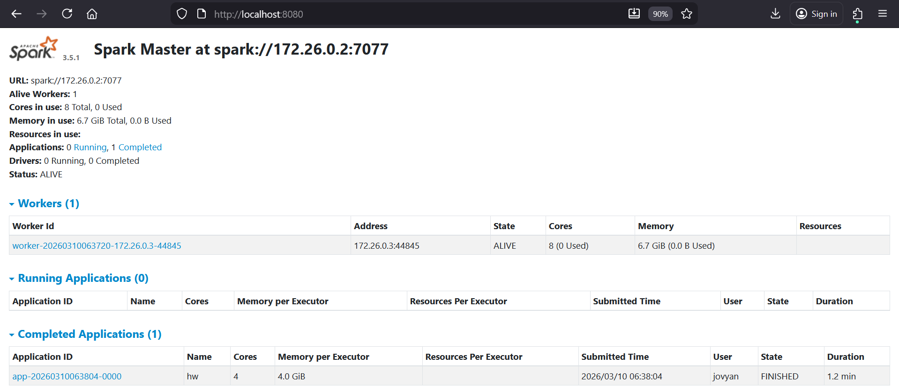
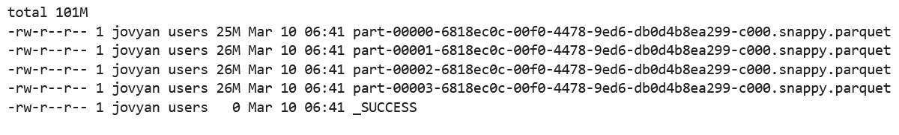
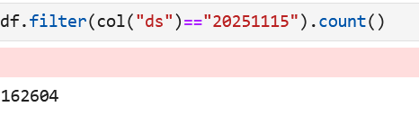
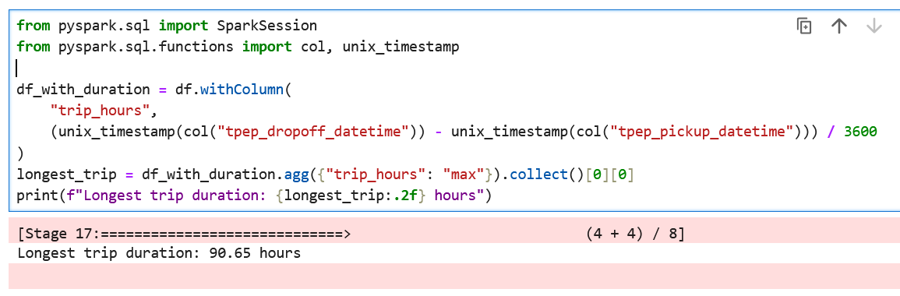
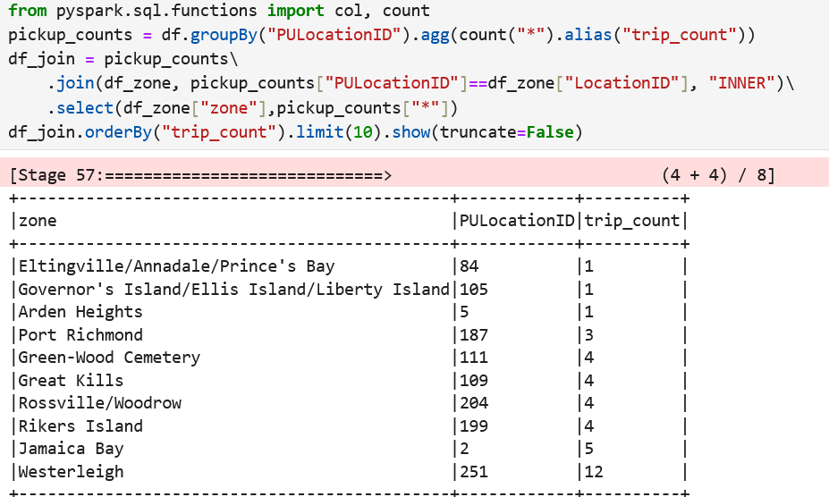

# Homework 06

## 1. Install Spark and PySpark
In this section, I use docker for composing spark-master, spark-worker, and jupyternotebook with pyspark. Run this command for runnin all container

```bash
docker compose up -d
```

After it is done, open browser then go to localhost:8080 for check the UI spark. Open localhost:8888 for jupyter notebook.

result:


## 2. Yellow November 2025

result:


## 3. Count records

result:


## 4. Longest trip

result:


## 5. User Interface
UI Spark dashboard will run in port 8080

result:


## 6. Least frequent pickup location zone
The answer can be 2 option either Governor's Island/Ellis Island/Liberty Island or Eltingville/Annadale/Prince's Bay

result:
