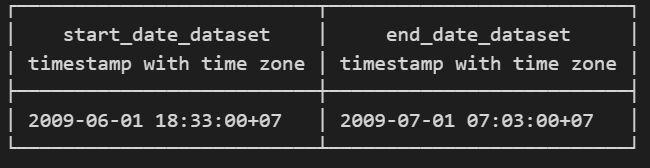
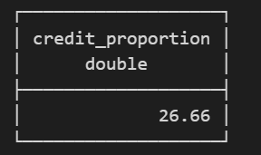
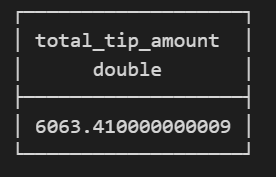

# Workshop
This session I use dlt for ingestin data from API. Data will load to DuckDB.

[Script Ingestion](dlt_nyc_taxi.py)

After ingestion succes, run command pip install duckdb for connection to duckdb. Then, check data from DuckDB. Use this script for check data.

``` python
import duckdb
path_duckdb = your_path
con = duckdb.connect(path_duckdb)

con.sql("select * from nyc_taxi_data.nyc_taxi").show()
con.close()
```

## 1. Start date and end date of the dataset

``` sql
select
min(trip_pickup_date_time) as start_date_dataset,
max(trip_dropoff_date_time) as end_date_dataset
FROM nyc_taxi_data.nyc_taxi;
```

Result:



## 2. Proportion of trips are paid with credit card

``` sql
select 
count(CASE WHEN payment_type = 'Credit' THEN 1 END)/count(*)*100 as credit_proportion
FROM nyc_taxi_data.nyc_taxi;
```

Result:



## 3. Total amount of money generated in tips

``` sql
select sum(tip_amt) as total_tip_amount
FROM nyc_taxi_data.nyc_taxi;
```

Result:


